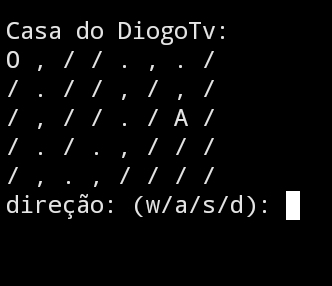

# Diogo House

  

## Este jogo foi uma ideia do meu amigo [DiogoTV](https://github.com/DiogoTVV) e eu criei ele utilizando a linguagem C.

  

### O objetivo é chegar com o 0 na letra A que é o final da fase, chegando lá você consegue finalizar o jogo.

## Eu também deixei outras fases em baixo de todo o código, é só modificar o código para jogar.
 
### Espero que tenham gostado :D
