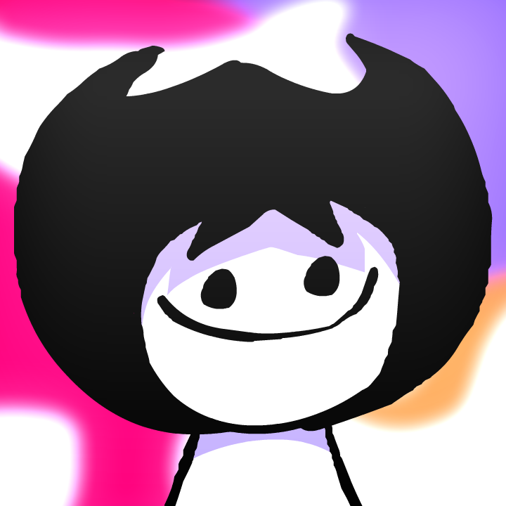

# Diogo House

## Este jogo foi um ideia totalmente do meu amigo [DiogoTV]() que fez no portugol web studio, eu apenas converti para a linguagem C

<h3>Onde o objetivo é chegar com  na letra A que é o final da fase, chegando lá você consegue finalizar o jogo</h3>

## Eu também deixei outras fases criadas pelo [DiogoTVV]() em baixo de todo o código é só modificar o código para jogar</h3>

##

<h4>Essas foram as tecnologias utilizadas:</h4>

##

<h5>Espero que tenham gostado :D</h5>